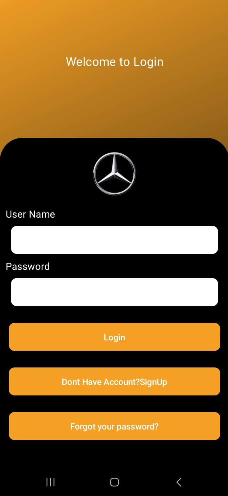
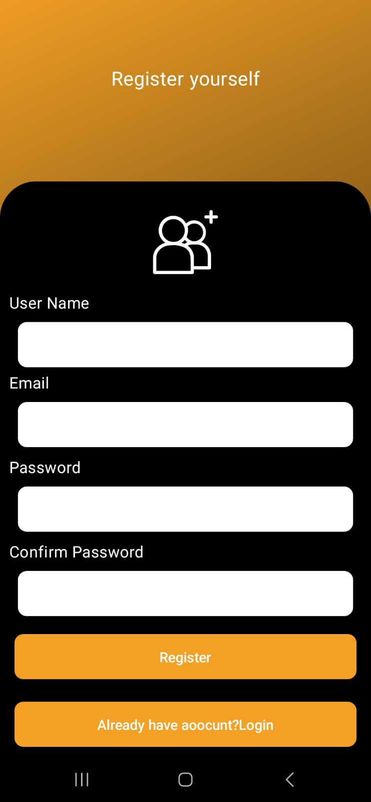
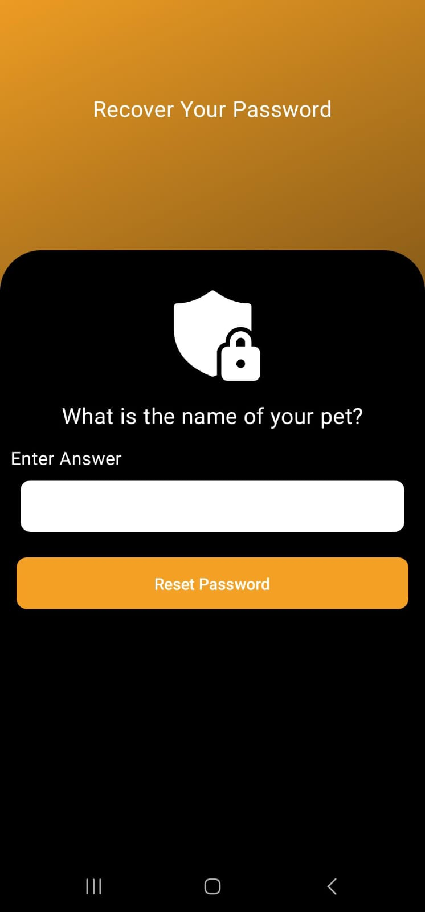
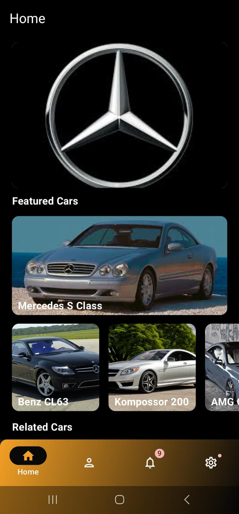

# INTRODUCTION 
## 🚀 Jetpack Compose Navigation Demo – Login Dashboard & Bottom Navigation
This is a basic yet complete Jetpack Compose-based Android app that demonstrates how to implement structured navigation using Jetpack's Navigation Component in a Compose environment.

The project features a clean login/signup flow, a forgot password screen, and a multi-tab dashboard powered by a Bottom Navigation Bar. It’s perfect for developers looking to learn or showcase foundational navigation patterns in modern Android development.

## 🧩 Key Highlights
#### 🔐 Authentication Flow
Includes Login, Sign Up, and Forgot Password screens with Compose-based UI.

#### 🧭 User-Friendly Navigation
Tap through each question with a seamless flow and intuitive layout.
#### 📱 Dashboard Navigation
After authentication, users are taken to a dashboard with 4–5 main tabs.
#### 🔄 Bottom Navigation Bar
Built using Compose and integrated with Navigation Component for seamless screen switching.
#### 🧭 Navigation Component Integration
Handles all route management cleanly and efficiently — a great example for those learning Compose navigation.
#### ✨ Modern UI with Jetpack Compose
UI is built entirely in Compose, following best practices for clean architecture and navigation handling.

## 📸 User Interface
### Authentication

### Forgot Password

### Bottom Navigation

